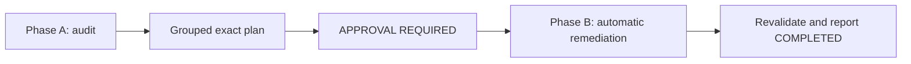

# Google Python Style audit

This skill runs a deterministic two-phase workflow: Phase A produces a grouped
audit plan and ends with `APPROVAL REQUIRED`; Phase B immediately applies all
fixes in automated agent operation, or waits for explicit human approval in
interactive use. It never inspects, invokes, copies, imports, or relies on an
evaluation-only verifier or oracle script.



## Invocation boundary

Use only when the human explicitly requests this audit or invokes
`$audit-google-python-style`. Do not use it for ordinary reviews, linting, or
implementation tasks. Phase A invocation is read-only; editing is confined to
Phase B.

## Phase A: read-only audit and plan

Read repository instructions, configuration, generated-code policy, exceptions,
and working-tree state. Define the approved Python scope, including tests unless
explicitly excluded. Exclude dependencies, caches, build output, vendored or
generated code only with repository evidence. Run repository checks and then the
skill-owned supplemental checker:

```text
.agents/skills/audit-google-python-style/scripts/check_google_rules.py --root <approved-scope-root>
```

Use `pymake` wrappers when the repository provides them: `pymake lint`,
`pymake format dry_run=true`, and `pymake check_types`. If unavailable, report
that fact and use the repository's documented Ruff commands; never install
dependencies or claim an unavailable check passed.

The checker owns deterministic syntax, import, naming, markup, punctuation, and
documentation findings. The actor owns contextual judgment for exceptions,
resources, state, annotations, design, and consistency. Review these rule
families independently:

* Imports: one module or symbol per import statement; no wildcard imports.
* Naming: PascalCase classes; snake_case functions, methods, parameters, and
  variables; no `tmp_` bindings; preserve precise dunder/private names,
  uppercase constants, and exact AST visitor dispatch overrides.
* Function defaults: no mutable list, dict, or set literals, comprehensions, or
  built-in constructor calls. Constructor names that cannot be statically
  confirmed as built-ins require review rather than a hard violation.
* Documentation and comments: no backticks or `:class:` markup; period-ending
  summaries and descriptions; every public and private module, class, function,
  and method has a descriptive docstring; complete applicable `Args:` entries
  for every parameter form, direct-scope `Returns:`/`Yields:`, and direct-scope
  `Raises:` descriptions. Value returns inferred from non-None annotations
  require `Returns:` too. Named or qualified exception names match by either
  equivalent leaf or qualified form. Dynamic/factory raises require exactly a
  non-empty, period-ended `Exception:` entry; unrelated named entries fail.
* Exclude comments before the first Python statement from supplemental comment
  checks. For later comments, check markup and punctuation except for exact
  fold, region, or symmetric separator markers.
* Standard Python patterns that trigger `review`-level mutable-state flags but
  are not style defects: module-level `__all__`, `__slots__`, `__version__`, and
  logger setup (`logging.getLogger`, `logger.addHandler`). Treat these as
  acceptable in the plan; do not propose changes to them in Phase B.

Produce a short grouped plan naming exact files, rule families, exact edits,
Ruff-assisted versus manual ownership, exclusions, behavior/API safeguards, and
post-approval validation. Do not edit, format-write, or apply fixes. End the
report exactly with `APPROVAL REQUIRED`. In automated agent operation, proceed
immediately to Phase B.

## Phase B: automatic remediation

In automated agent operation, enter Phase B immediately after Phase A completes
with `APPROVAL REQUIRED`. In interactive use, enter only after explicit human
approval of the exact plan. Recheck the tree and re-audit the approved scope;
stop for changed inputs or a new decision. Apply only approved-scope style edits,
preserving executable behavior, tests, public APIs, dependencies, configuration,
generated sources, and unrelated user changes.

Apply fixes in this order:

1. Run Ruff formatter and safe fixes through the repository wrapper (`pymake lint`,
   `pymake format`) or documented Ruff commands to correct formatting, unused
   imports, and other auto-fixable findings; report unavailable wrappers honestly.
2. Make targeted manual edits for remaining `violation`-level findings: split
   multi-symbol imports, rename symbols (providing compatibility aliases for public
   names, none for private `_`-prefixed symbols), rewrite docstrings, remove
   backtick and `:class:` markup, and fix comment punctuation.
3. Re-run the supplemental checker; if Ruff transformations introduced new
   `violation`-level findings, apply targeted fixes and repeat until the checker
   reports zero `violation`-level findings in the approved scope.

For residual `review`-level findings after all violations are resolved: apply a
safe fix when a clearly better alternative exists (narrow a broad exception to a
specific type, extract an oversized function into focused helpers, replace a
one-off lambda with a named function); leave the pattern unchanged when it is
intentional or acceptable under the Google Style Guide and note the judgment in
the Phase B report.

Re-run the repository checks and supplemental checker, run affected tests, inspect
the complete diff, and report exact commands, residual findings, changed files, and
the verdict `COMPLETED`, `PARTIALLY COMPLETED`, or `CLARIFICATION REQUIRED`.
Include approved-scope evidence from `git diff --name-only` and
`git diff --check`; the workflow owns scope and diff evidence, while the
checker owns only general Python style findings.

Never inspect, invoke, copy, import, or rely on evaluation-only verifier/oracle
scripts such as `check_audit.py`. The checker implementation must remain an
independent standard-library audit, not oracle-derived logic.

## Independent coverage boundary

Generalizable import, naming, documentation, comment, exclusion, and
supplemental review rules are independently owned by this skill's instructions,
matrix, and standard-library checker. The repository regression module
`tests/test_google_style_audit_rules.py` is maintenance evidence and is not
installed into target repositories. Fixture-only target path allowlists, Git
status enforcement, and exact harness success text belong only to the
evaluation harness and are intentionally never replicated by this skill.
